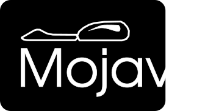

# 

# The Mojave OS Kernel

Developed by a team of students across multiple universities in the state of Georgia, the Mojave OS abuses the compute from the Quad-Core Cortex-A72 Processor and was designed for data acquisition and control.

## The Team

Our team is composed of the following people.

Name | Job | Contact 
-----|-----|-------------
Diego Alba | Kernel Development Lead, Project Manager | [LinkedIn](https://www.linkedin.com/in/dalbasudo/), [Github](https://github.com/DAlba-sudo/), [Email](mailto:diego.alba@malarylib.com).
Ryder Johnson | Member | [Github](https://github.com/UZ9)
Michael Seng | Bike Design Lead, Hardware Integration | N/A
Jared Inniss | Infrastructure / Operations Lead | [Email](Jaredinniss64@gmail.com)

## Want to help?

We are actively recruiting people to join our team. If you want to help develop a kernel, or maybe make a wooden e-Bike: we're waiting for you!
