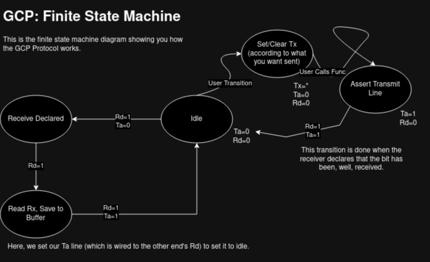

<div style="text-align: center; display: flex; align-items: center;">
    
    <p style="padding: 10px; font-size: 2em;">
        Mojave OS: Drivers
    </p>
</div>

#

Kernel-01A is decoupled from the Raspberry Pi's Hardware, **but** we still want to interface with it. Now, a sane developer would probably use off-the-shelf drivers. We don't. Here's why:

1. *Simplicity*: We strive to know our code-base in and out. Which means that using third-party drivers for the Pi adds an extra level of complexity in that we must read the documentation in and out, from the docs to the source-code.
    - This can add extra development time, as we must read through documentation to first determine if the driver is right for us, how the driver design decisions might affect our kernel's design, etc.

We are not arguing against the inclusion of third-party drivers into our kernel/OS. But for the bootstrapping process, it's clear that implementing our own drivers (at least for GPIO), is the fast and correct way to go; while providing our team with an invaluable learning experience.

## List of Drivers

Below is a quick table of contents you can navigate through to see how we've implemented our drivers!

- [GPIO](#gpio)
- [GCP](#gcp)

### GPIO
General Purpose Input/Output

We provide our own abstraction layer for GPIO. We provide a series of basic functions like:

* Set
* Clear
* Pull Up/Down
* Function Select

We do this via the memory mapped registers that the BCM2711 provides. Although we currently only provide support for the BCM2711, we've organized the driver and kernel build to integrate other boards.

### GCP
GPIO-Based Communication Protocol

We provide our own clock-independent communication protocol done over GPIO.

> I don't claim to be the inventory, but I did come up with this by myself with some "back of the napkin" drawings over coffee one day

Why make another communication protocol? In the early days of the kernel design process, when our team was still trying to get code to run on the Pi 4B, we weren't able to debug because of the following:

1. We didn't have a Serial to USB for debugging on the computer.
2. When we did get one, it seemed to be broken (either our implementation, or the cable itself).
3. We didn't have exposure to UART/Serial Based Communications (which made debugging the issues worse). 

It didn't help that UART is usually the first look in to the kernel (beyond flashing LEDs). We proposed GCP as an alternative. Here's how it works.

***GPIO Communication***

Our protocol closely resembles the TCP communication model, with ACK packets that say, "Hey, I received your message!". We implement this by having 4 GPIO Lines:

* Tx: Transmit Line
* Rx: Receive Line
* Ta: Transmit Assert
* Rd: Transmit Received 

Tx, Rx are your traditional communication lines where the bits are actually sent/received. 

Ta is a transmit assert line which lets the receiver (another device with GPIO capabilities) know: "Hey, whatever you're reading in your Rx line is the bit I want to send". 

Rd lets the host know: "Wow, someone wants to talk to me? Let me check my Rx line".

***Finite State Diagram***



Pardon the crude drawing, but that should give you an idea of how it works. We still haven't implemented it, but I'll update here with some stats about it's performance.


*Still deciding whether this is the best place to put the GCP library*

```
If you have any questions or concerns, let us know!
```
